---
## I am a Developer and use this lanuages:

1. HTML📝: for structuring ideas
2. CSS(SASS)📕📗📘📙: for styling them beautifully 
3. JavaScript🧩:  for bringing them to life
4. Python 🐍: for logic, automation, and backend power
5. C++🪄: for more performance(and because it's cool😃)

## 🚀 Goals

I’m always learning and improving.
My current goal: to become a stronger, more efficient developer through open collaboration.

## 💬 How You Can Help

If you have suggestions or improvements, please open a Pull Request or start a Discussion.
I’m open to feedback and love learning from other developers.

## ⚙️ Fun Fact

I sometimes break code just to learn how to fix it better.
